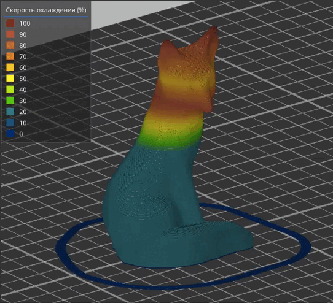

# **gcode-editor**

 

[Краткий видеообзор и пример печати](https://www.youtube.com/watch?v=ptvMgCJ_OCE)

Данный скрипт автоматической генерации макросов для SuperSlicer, позволяет 
избежать деффектов 3D-печати, возникающих при резком изменении тех или иных 
параметров, а так же повысить эффективность и качество печати путем плавного 
и точного изменения выбранных параметров в заданных диапазонах слоев 3D модели. 

***

#### Список параметров:
* Температура экструдера - M104 S___
* Температура экструдера (установить и ждать) - M109 S___
* Обдув - M106 S___
* Скорость (%) - M220 S___
* Поток - M221 S___
* Скорость (лимит) - SET_VELOCITY_LIMIT VELOCITY=___*
* Скорость прохождения угла - SET_VELOCITY_LIMIT SQUARE_CORNER_VELOCITY=___*
* Ускорение - SET_VELOCITY_LIMIT ACCEL=___*
* Ускорения и торможения - SET_VELOCITY_LIMIT ACCEL_TO_DECEL=___*
* ~~Pressure advance - pressure_advance K=___*~~ (пока не работает)
<small>* - макросы для klipper</small> 

***

#### Типы экструзии:
* Периметры
* Внешние периметры
* Свисающие периметры
* Заполнение
* Сплошное заполнение
* Заполнение зазоров
* Верхнее сплошное заполнение
* Внутреннее заполнение моста
* Тонкие линии
* Линии поддержки
* Связующие линии поддержки

***

#### Пример
>В первом диапазоне на слоях со 115 по 195 у типов линий: периметры и 
заполнение зазоров - обдув будет плавно увеличиваться c 30% до 100%, 
а скорость будет уменьшается cо 100% до 10%. Во втором диапазоне на 
слоях со 196 по 265 у типов линий: периметры и заполнение зазоров - 
обдув будет плавно уменьшается cо 100% до 30%, а скорость будет 
увеличивается c 10% до 100%.

В данном случае это может позволить печатать 
более качественные нависания за минимальное время. При этом  линии 
внутреннего заполнения в этих диапазонах слоев будут печататься с указанными 
при нарезке в слайсере параметрами - обдув 30% и скорость 100% либо тоже 
можно задать индивидуальные режимы.
